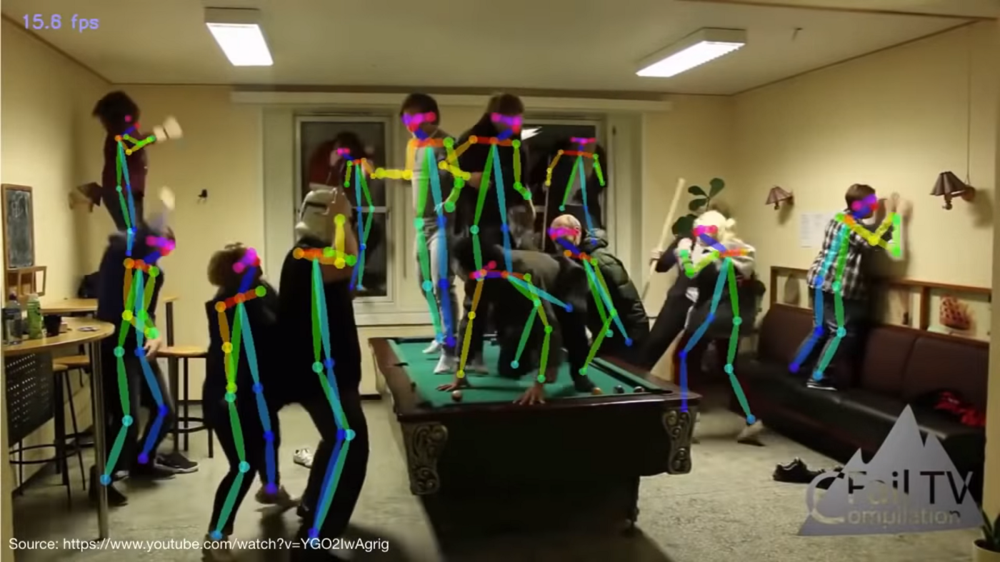
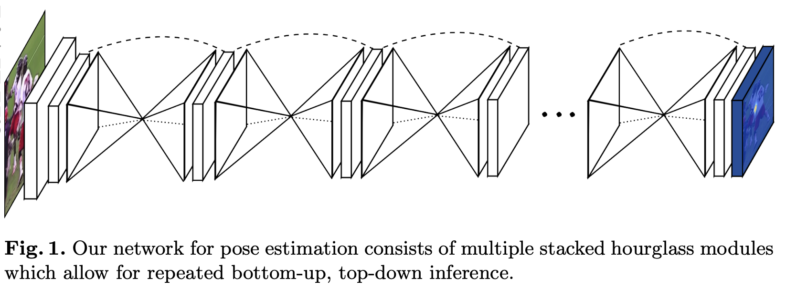
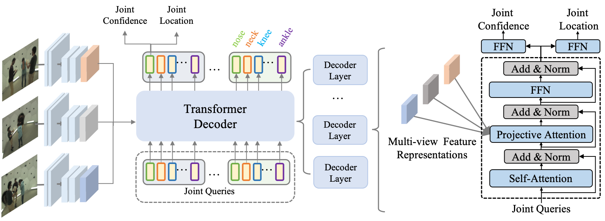
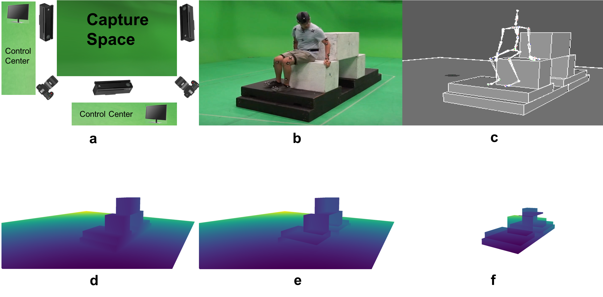

# STANCE

## Related Works

### [To Understand Human Poses](https://towardsdatascience.com/using-hourglass-networks-to-understand-human-poses-1e40e349fa15)

  

### [Stacked Hourglass Network](https://paperswithcode.com/method/stacked-hourglass-network)

  

### [Multi-View Pose Estimation](https://arxiv.org/abs/2111.04076)

  

### [More On Pose Estimation](https://github.com/wangzheallen/awesome-human-pose-estimation#video-pose)

  

WHY STANCE? 

STANCE LIKE NAIL IN THE BOARD. STANCE HELPS WE DEFINE HOW WE MOVE, CONTRARY TO THE BELIEVE OF THE STATIC-ISH POSTURE.

LET'S TALK ABOUT DIVERSITY. MOVEMENT BETWEEN STANCES - OR THE TRANSITION - OR THE SHIFTING OF BODY AND LIMBS AND EYE - ARE DIFFERENT FROM PEOPLE TO PEOPLE. AS THE BASIS OF MOVEMENT, IT FORMS THE DISTINCTION OF EVERY METHOD. WITHOUT THAT BASIS, WE NOLONGER RECOGNIZE WHAT IS THE SOUL OF THE MOVES AND HENCE VERY DIFFICULT TO COMPREHEND WHAT IS GOING ON THERE.

LIKE FRAME TO THE PICTURE. LIKE NAIL TO THE WOODBOARD. STANCE DEFINE HOW WE MOVE. LIKE TWO SIDES OF A COIN, STANCE BRINGS THE STATIC-NESS TO THE DYNAMIC OF MOVEMENT, AND COMPLETE IT.